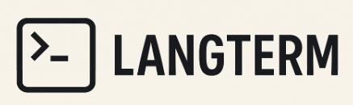

# Langterm

Langterm translates natural language to executable shell commands using local AI models through Ollama. It works on Windows, macOS, and Linux.

## Prerequisites

1. **Node.js 18+** - Required to run langterm
2. **Ollama** - Install from [https://ollama.com](https://ollama.com)
3. **An Ollama model** - Pull one before first use:
   ```bash
   ollama pull codestral:22b
   # or for a lighter/faster model:
   ollama pull deepseek-coder:6.7b
   ```

## Installation

### Using npx (no installation needed)
```bash
npx langterm
```

### Global installation
```bash
npm install -g langterm
```

## Usage

### First Run
When you run langterm for the first time, it will:
1. Check if Ollama is running
2. Show available models
3. Let you select your preferred model
4. Save your choice for future use

### Basic Usage
```bash
# Interactive mode
langterm

# Direct command
langterm list all files larger than 100MB

# With quotes for complex commands
langterm "find all Python files modified in the last week"
```

### Examples
```bash
langterm show disk usage sorted by size
langterm find process running on port 8080
langterm create tar archive excluding node_modules
langterm "convert all PNG images to JPG in current directory"
langterm extract audio from video.mp4 as mp3
```

### Options
- `langterm --setup` - Reconfigure model selection
- `langterm --model <name>` - Use a specific model for this run
- `langterm --help` - Show help message
- `langterm --version` - Show version

## How It Works

1. You describe what you want in plain English
2. Langterm sends your request to your local Ollama model
3. The AI generates the appropriate shell command
4. You review the command and press Enter to execute (or Ctrl+C to cancel)

## Configuration

Langterm saves your model preference in `~/.langtermrc`. You can:
- Run `langterm --setup` to change models
- Edit the file directly
- Use `--model` flag to temporarily use a different model

## Troubleshooting

### "Ollama is not running"
Make sure Ollama is running:
```bash
ollama serve
```

### "No models found"
Pull a model first:
```bash
ollama pull codestral:22b
```

### Command generation issues
- Try being more specific in your description
- Some models work better than others for command generation
- Codestral and DeepSeek Coder models are recommended

## Privacy

All processing happens locally on your machine. No data is sent to external servers.

## License

MIT